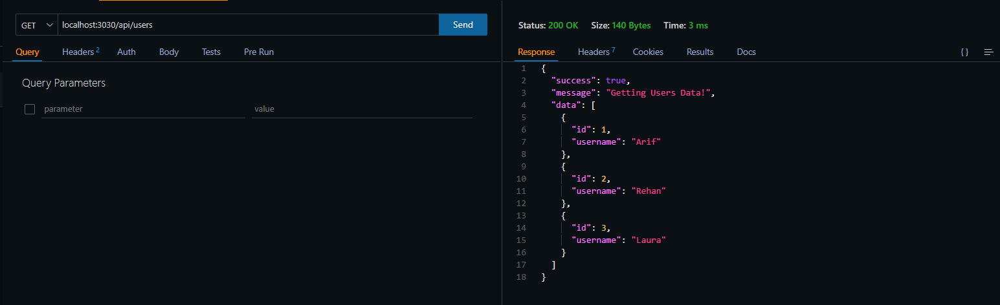

# LOGIC GET DATABASE FROM API

## HOW TO BUILD AND RUN PROGRAM :
1. **Create Database :**
- run MySQL on XAMPP.
    
- open cmd or use the shortcut on the keyboard by pressing the Windows + R keys then type CMD and ENTER.
- then open the xampp > mysql > bin directory .
- or use the following command: `cd ../../xampp/mysql/bin`.
- then enter the command: `mysql -u root` to enter MariaDB.
- then create a database and create a user table then enter the user data.

2. **Express.JS Installation :**
- `mkdir express_api` : express_api => is the name of the folder and it can be changed according to your preference.
- `cd expreees_api` : express_api => this command will open the folder you have created.
- `npm init -y` : When you run this command, npm will create a package.json file with default values, including project name, version, description, and more.
- `npm i express` : this will install Express.JS to your project.
- `npm cors` : CORS allows us to make requests to resources in other domains, as long as servers from those domains explicitly allow it.
- `npm i nodemon --save-dev` : command used to install nodemon as a development dependency in a Node.js project.
- `npm i mysql --save` : command to install mysql as a dependency in the Node.js project.

3. **React.JS Installation :**
- `npm create vite@latest` 
- then you will be asked to enter your project name
- then customise what stack you're going to use, but in my project, I'm using React and normal Javascript.
- `cd (project-name)` : open your project using the command.
- then install react with the following command `npm install`

### Create Database MySQL :
1. create a database with the command :
`create database api;`

2. use the database:
`use api;`

3. create a table with the :
```
create table users (
    -> id int not null,
    -> username varchar(255) not null,
    -> primary key (id));
```

4. adds the data content to the users table:
```
insert into users values
    -> ('1','Arif');
```

5. view all data in the users table 
`select * from users;`

- output
```
+----+----------+
| id | username |
+----+----------+
|  1 | Arif     |
+----+----------+
```


### RUN PROGRAM :
1. use the `npm run dev` command to run express as the babckend (API) or react as the frontend (client).
2. in the API project use the Thunder Client extension to help see the results created from the API programme.
    
3. on the Thunder Client adjust what method is used and then enter the endpoint that matches the API programme that has been created.
    
4. in the React project as Frontend (Cliend-Side) make sure the target endpoint to the API is correct according to the programme that has been created.

# Requirements :
- Create Database
- Install Node.JS.
- Install Express in the project to create an API program.
- Install React as client-side.

# Disclaimer :
This project is made to megasah my logic as a fullstack developer and provide an overview when retrieving data in the database through the API so that the program ecosystem is made tidier and safer with a structured path.

# Contributing:
Pull requests are welcome. For major changes, please open an issue first to discuss what you would like to change.

**Developed by: Muhamad Nur Arif**

**LinkedIn:** https://www.linkedin.com/in/marif8/
